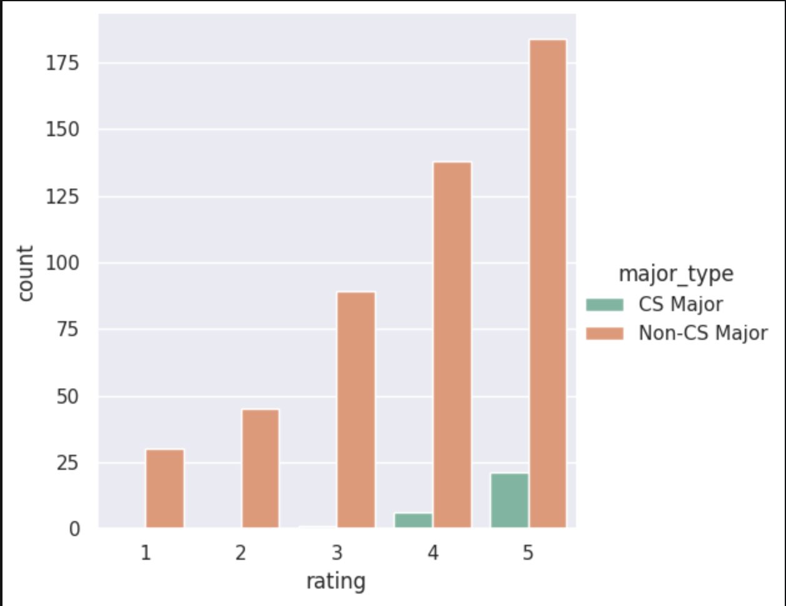
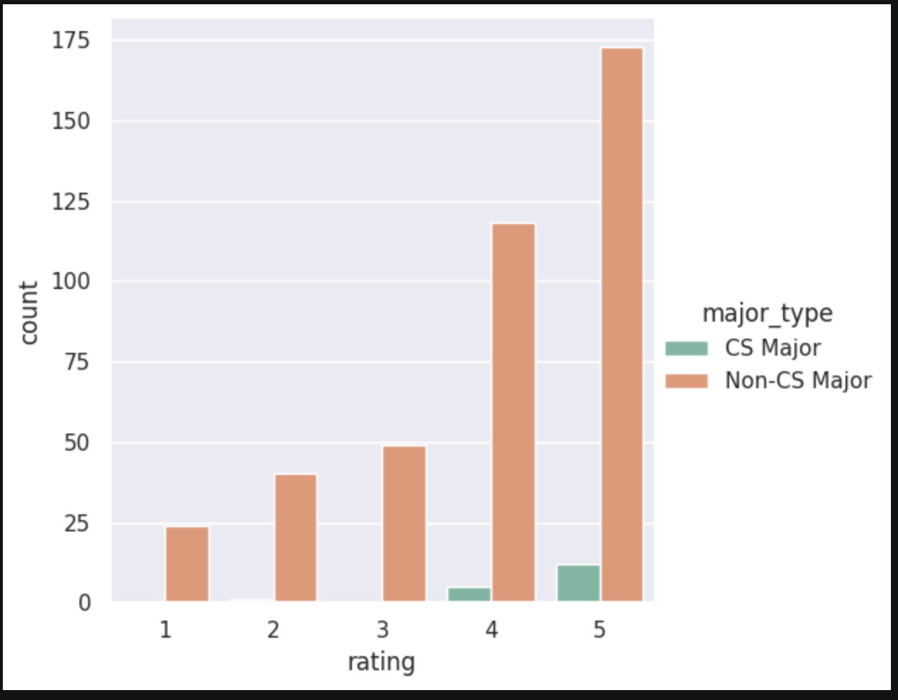
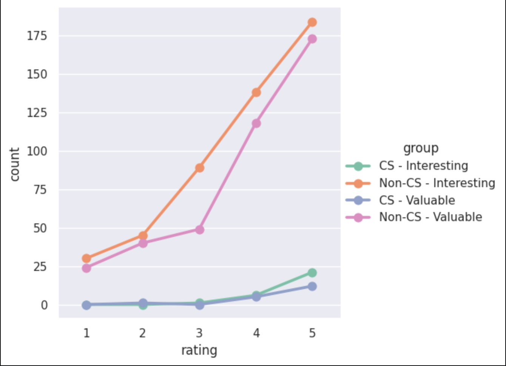
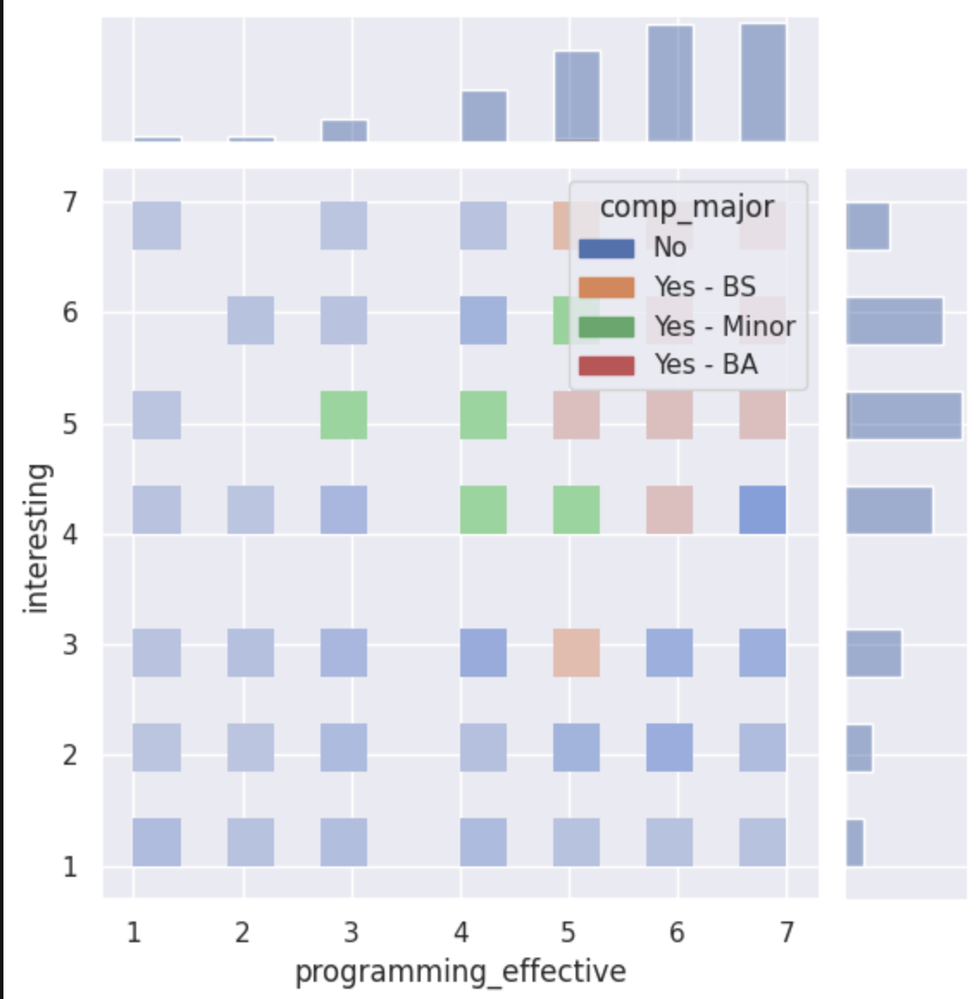

---
# Do not edit the text between these lines!
layout: default
---

# Proposal for Comp110 Improvement

<!-- This is a comment. Below, you'll see code for inserting an image. To make this image appear, update <custom-path>. To add an image, save it inside the imgs folder of this repository. -->
/static/imgs/logo.png" alt="Image of Comp110 rainbow logo. "  width="500"/>

## Summary of analysis performed in notebook

We wanted to analyze the class data to see if it supported our project proposal. Our idea was that the course's exercises should have more opportunities for creativity because it makes the exercises more interesting and valuable to students with majors outside of Computer Science. 

To do this we used the following four charts: 

In the figure above, CS majors and non-CS majors ranked their interest in the course about equally. However, raw counts could be misleading because there are way more non-CS majors than CS majors. 

To explore whether Non-CS Majors and CS-Majors find the course similarly valuable to them. We'll count how many students from each major type (non-CS and CS) gave each 'valuable' rating. We'll use 'count' to find out the number of each response, then filter to separate the two majors. This is represented above in a bar graph.

To understand whether CS and non-CS find COMP 110 more interesting or more valuable, we will use a catplot (categorical relationship) to plot the number of CS and non-CS students that selected each rating on the survey. 

At this point, we googled seaborn plots to see the extent of what we could do with this package. We saw this one on the website and replicated it below. What was cool about this plot is that it puts all four variables together. We are able to see the comparitive numbers of CS and non-CS who find the course interesting vs. effective. Though we were just playing around with the capabilities of seaborn, this plot is actually interesting. It shows that people with CS majors ranked the exercises more effective and more interesting than the non-CS majors, despite there just simply being more non-CS majors. 

## Conclusion:

Our initial hypothesis was that if a person is a computer science major, they are more likely to rate the class higher in the interesting, valuable, and effective areas of the survey. We analyzed this hypothesis first using the 'count' function to graph interesting and valuable ratings by major. We found that the ratio of students who scored the class 1 or 2 on interesting and valuable was much higher for non-computer science majors than computer science majors. Then, we used a catplot to analyze the categorical relationship between computer science/ non-computer science majors and the score the gave the class on the interesting and valuable question of the survey. The amount of 1s and 2s that non-computer science majors gave the class was much higher than the amount of 1s and 2s that computer science majors gave the class (which was close to zero).
Then, we analyzed the programming_effective variable so that we could understand if the programming assignments were helpful to the students. We used a joint grid and found that the number of low ratings (1s and 2s) in the interesting and effective categories mostly belonged to non-computer science majors, and shown on the bottom left side of the graph. The high ratings are mostly colored green, red, and orange (meaning they belong to computer science majors and minors).
Using this data we came to the conclusion that non-computer science majors are more likely to score the class low (1 or 2) in the interesting, valuable, and effective catgories. We decided this is most likely because computer science majors already find coding interesting and therefore the assignments automatically cater to their interests. Our idea is to include parts of assignments that are more open ended and can be done in a way that specifically relates to the student's field of study. For example, the river assignment could have an open ended portion that would allow an education major to simulate a school or an environmental science major to simulate a specific ecosystem. This would allow students to feel more connected to the assignments and learn more about coding in the process. It would hopefully increase the level of interest they have in the course and how much value they find in it if the assignments are more effective and interesting.
There are several downsides to this idea, however. First of all, it would make it difficult to implement an auto-grader because everyone's assignments are a little different and the auto-grader may not recognize that some assignments, although different, are still correct. It could also potenially make the instructions more confusing or increase the difficulty level for beginnger programmers. 
To implement this idea as future work, one extension that could be added is in-class examples of open ended programming assignments. Dr. Hinks could give the class a structure of code and instruct them to add their own twist thats more creative, while TAs walk around to assist and answer questions. This would allow students to feel more confident in their coding and maybe get ideas for programming assignements. 